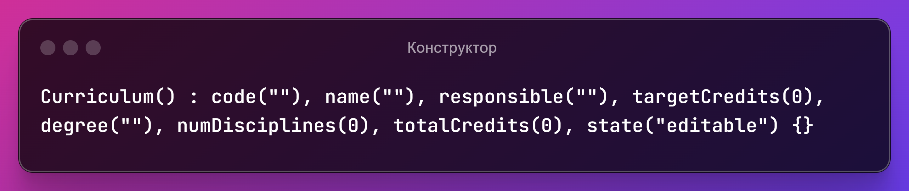
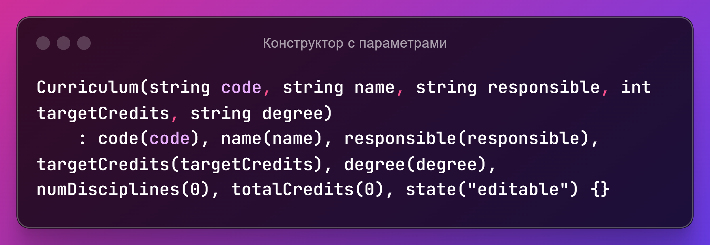
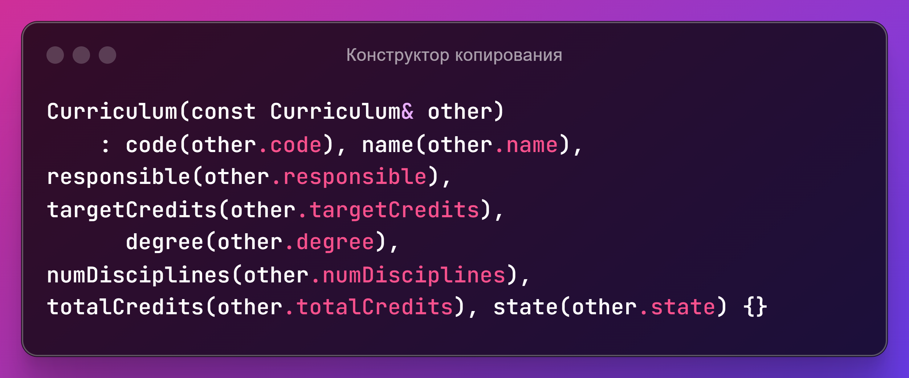
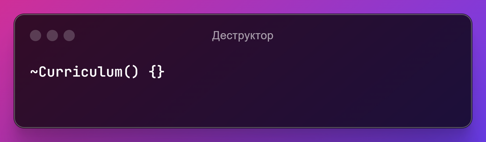

# Проект "Реализация класса"
### Задача: Реализовать класс, моделирующий заданный тип объектов предметной области.
## Цель
разработать класс Учебный план.
## Задачи
1. Определить структуру данных для хранения информации об учебном плане.
    - Создать класс.
    - Добавить конструкторы.
    - Добавить геттеры и сеттеры для доступа к членам данных.
2. Реализовать функцию ввода данных для учебного плана.
    -  Добавить метод *inputData()* в класс *Curriculum*, который будет запрашивать у пользователя информацию об учебном плане и инициализировать соответствующие члены данных.
    -  Реализовать ввод данных с проверкой на корректность введенных значений.
3. Реализовать активацию учебного плана.
    -  Добавить метод *activatePlan()* в класс *Curriculum*, который будет проверять, можно ли активировать учебный план на основе текущих значений членов данных.
4. Реализовать отображение информации об учебном плане.
    - Добавить метод для отображения информации об учебном плане в классе *Curriculum*.
5. Создать пользовательский интерфейс для работы с учебным планом.
    - В функции *main()* создать объект класса *Curriculum* и реализовать пользовательский интерфейс для работы с ним.
    - добавить меню.
    - Использовать цикл *do-while* для отображения меню и обработки выбранных пользователем вариантов до тех пор, пока пользователь не выберет вариант выхода из программы.

## Выбор области
### Учебный план
Необходимо разработать класс **Учебный план** для автоматизирующей 
разработку учебных планов подсистемы информационной системы 
университета. 

Учебный план **состоит из дисциплин**. За прохождение каждой 
дисциплины даётся некоторое количество зачётных единиц. Сумма зачётных 
единиц за все дисциплины, включенные в учебный план, должна совпадать с 
целевым количеством зачётных единиц учебного плана. Количество 
дисциплин и суммарное количество зачётных единиц за них могут быть 
равны 0 только одновременно. План может быть введён в действие, только 
если сумма зачётных единиц за дисциплины совпадает с целевый 
количеством зачётных единиц, а также все поля заполнены. Введённый в 
действие учебный план нельзя редактировать.

**Поля:** шифр, название, ФИО ответственного за план, целевое количество 
зачётных единиц, ступень высшего образования (бакалавриат, магистратура, 
аспирантура), количество дисциплин, суммарное количество зачётных 
единиц за дисциплины, состояние (редактируется, введён в действие).

**Методы:** конструктор с шифром, названием, ФИО ответственного за план, 
целевым количеством зачётных единиц, ступенью высшего образования; 
установить и вернуть шифр; установить и вернуть название; установить и 
вернуть ФИО ответственного, установить и вернуть целевое количество 
зачётных единиц, установить и вернуть ступень высшего образования, 
установить количество дисциплин и суммарное количество зачётных единиц 
за них, вернуть состояние, ввести план в действие.

## Тестовые данные и ожидаемые результаты 
|Ввод|Ожидаемый результат|Фактический результат|Вывод|
|--------|--------|--------|--------|
|Enter curriculum code (up to 10 digits): 43234234234234|Error: Code must contain only digits, be non-empty and not exceed 10 characters.|Error: Code must contain only digits, be non-empty and not exceed 10 characters.|Успешно!|
|Enter curriculum name (up to 50 letters): dfhsdyufghsduifhsdyuhfisudhfiusdhifuhsdifhsdiufhisduhfisduhfiudshifhsdifhfdsfsdfsdfsd|Error: Name must contain only letters, be non-empty and not exceed 50 characters.|Error: Name must contain only letters, be non-empty and not exceed 50 characters.|Успешно!|
|Enter responsible person's full name (up to 100 letters and spaces): gsadgasuygduaysgdugasudgysaugd sdgyasuygdusyagduygsadgasuygduyasggdsayugdyuasgdguy sgydusyaduygasdugysaugydgyuasdgyuasguydaygudgyuasgyuasgyuasdgyuasdgyu|Error: Full name must not exceed 100 characters.|Error: Full name must not exceed 100 characters.|Успешно!|
|Enter target number of credits (between 1 and 150): 450|Error: Target number of credits must be between 1 and 150.|Error: Target number of credits must be between 1 and 150.|Успешно!|
|Enter number of disciplines (between 1 and 50): 55|Error: Number of disciplines must be between 1 and 50.|Error: Number of disciplines must be between 1 and 50.|Успешно!|
|Enter total number of credits for disciplines (between 1 and 200): 230|Error: Total number of credits must be between 1 and 200.|Error: Total number of credits must be between 1 and 200.|Успешно!|
## Проектирование свойств класса
1. *code* (тип данных string): Код учебного плана, который должен быть уникальным и состоять только из цифр. Ограничение на диапазон: максимальная длина 10 символов.
**Обоснование:** Код служит для уникальной идентификации учебного плана. Ограничение на длину - это практическое требование для удобства поиска и записи кодов.
3. *name* (тип данных string): Название учебного плана, которое должно состоять только из букв. Ограничение на диапазон: максимальная длина 50 символов.
**Обоснование:** Название должно быть информативным и кратким. Ограничение на длину устанавливается для того, чтобы названия учебных планов не были слишком длинными.
4. *responsible* (тип данных string): ФИО ответственного лица за учебный план. Ограничение на диапазон: максимальная длина 100 символов, допускаются только буквы и пробелы.
Обоснование: Необходимо знать, кто отвечает за конкретный учебный план. Ограничение на длину устанавливается для того, чтобы ФИО не было слишком длинным.
5. *targetCredits* (тип данных int): Целевое количество кредитов, которое студент должен получить, чтобы завершить учебный план. Ограничение на диапазон: от 1 до 150.
**Обоснование:** Целевое количество кредитов определяет объем учебной нагрузки, необходимый для получения степени. Ограничение на диапазон устанавливается исходя из общепринятых практик в системе образования.
6. *degree* (тип данных string): Уровень образования, на котором реализуется учебный план. Ограничение на диапазон: допустимы значения “bachelor”, “master”, “postgraduate”.
**Обоснование:** Уровень образования определяет специализацию и сложность учебного плана. Ограничение на диапазон предотвращает ввод неверных значений.
7. *numDisciplines* (тип данных int): Количество дисциплин, включенных в учебный план. Ограничение на диапазон: от 1 до 50.
**Обоснование:** Количество дисциплин влияет на структуру и объем учебного плана. Ограничение на диапазон устанавливается с учетом обычных практик в образовательной системе.
8. *totalCredits* (тип данных int): Общее количество кредитов по всем дисциплинам учебного плана. Ограничение на диапазон: от 1 до 200.
**Обоснование:** Общее количество кредитов соответствует общему объему учебной нагрузки. Ограничение на диапазон устанавливается с учетом возможного размера учебных программ.
9. *state* (тип данных string): Текущее состояние учебного плана. Ограничение на диапазон: “editable” или “activated”.
**Обоснование:** Состояние показывает, можно ли вносить изменения в учебный план (editable) или он уже утвержден (activated).

### Библиотеки
**iostream:**

Обоснование: Обеспечивает стандартные потоки ввода-вывода (стандартный ввод cin, стандартный вывод cout, стандартный вывод ошибок cerr). Используется для вывода сообщений на экран, ввода данных от пользователя.

**string:**

Обоснование: Предоставляет класс string для работы со строками. Используется для хранения кода учебного плана, названия, ФИО ответственного лица, уровня образования и состояния учебного плана.

**limits:**

Обоснование: Используется для получения максимального значения типа данных streamsize (например, numeric_limits<streamsize>::max()) для управления буфером ввода. Это необходимо для очистки буфера ввода в случае ввода некорректных данных.

**algorithm:**

Обоснование: Предоставляет стандартные алгоритмы, такие как all_of, count, transform. Используются для проверки условий (например, все ли символы в строке являются цифрами) и преобразования строк (например, приведение строки к нижнему регистру).

**cctype:**

Обоснование: Предоставляет функции для классификации символов, например, isalpha и isdigit. Используются для проверки формата введенных данных (например, состоит ли код только из цифр, состоит ли название только из букв).

**Выбор библиотек является логичным и соответствует задачам кода:**

*iostream:* Необходима для взаимодействия с пользователем, вывода информации и ввода данных.

*string:* Используется для хранения и обработки текстовых данных, которые характеризуют учебный план.

*limits:* Обеспечивает безопасную работу с буфером ввода, предотвращая ошибки при вводе некорректных данных.

*algorithm:* Предоставляет удобные инструменты для обработки данных, например, проверки формата введенных данных.

*cctype:* Необходима для классификации символов и проверки правильности ввода пользователя.

## Разработка конструкторов и деструктора
|Код|Назначение|Список параметров|Значения параметров по умолчанию|
|--------|--------|--------|--------|
||Создает объект Curriculum с начальными значениями полей, заданными по умолчанию.|Отсутствуют.|code: пустая строка ("") name: пустая строка ("") responsible: пустая строка ("") targetCredits: 0 degree: пустая строка ("") numDisciplines: 0 totalCredits: 0 state: “editable”|
|| Создает объект Curriculum с заданными значениями для code, name, responsible, targetCredits и degree.|code: Строка, представляющая код учебного плана. name: Строка, представляющая название учебного плана. responsible: Строка, представляющая ФИО ответственного лица. targetCredits: Целое число, представляющее целевое количество кредитов. degree: Строка, представляющая уровень образования|Отсутствуют.|
||Создает копию объекта Curriculum, используя данные из другого объекта Curriculum.|other: Константная ссылка на объект Curriculum, который будет скопирован.|Отсутствуют.|
||Выполняется при уничтожении объекта Curriculum.|не имеет.|не имеет.|

## Проектирования методов класса

### Открытые методы (public):
1. void addDiscipline(string name, int credits).
2. void removeDiscipline(string name).
3. void printDisciplines().
4. bool isActivated().
5. void changeState(string newState).
### Закрытые методы (private):
1. bool isValidName(string name).
2. bool isValidCredits(int credits).
3. bool isDisciplineExists(string name).

### Блок-схемы

## Проектирование главной функции (main)
1. Определить структуру данных для хранения информации об учебном плане.
   - Создать класс Curriculum с приватными членами данных для хранения информации об учебном плане, таких как код, название, ответственное лицо, целевое количество кредитов, уровень образования, количество дисциплин и общее количество кредитов.
   - Добавить конструкторы по умолчанию, для инициализации всех членов данных и для инициализации части членов данных.
   - Добавить геттеры и сеттеры для доступа к членам данных.
2. Реализовать функцию ввода данных для учебного плана.
   - Добавить метод inputData() в класс Curriculum, который будет запрашивать у пользователя информацию об учебном плане и инициализировать соответствующие члены данных.
   - Реализовать ввод данных с проверкой на корректность введенных значений.
3. Реализовать активацию учебного плана.
   - Добавить метод activatePlan() в класс Curriculum, который будет проверять, можно ли активировать учебный план на основе текущих значений членов данных.
4. Реализовать отображение информации об учебном плане.
   - Добавить метод для отображения информации об учебном плане в классе Curriculum.
5. Создать пользовательский интерфейс для работы с учебным планом.
   - В функции main() создать объект класса Curriculum и реализуйте пользовательский интерфейс для работы с ним.
   - Использовать цикл do-while для отображения меню и обработки выбранных пользователем вариантов до тех пор, пока пользователь не выберет вариант выхода из программы.
  
# Заключение 
В отчёте представлен класс Curriculum, который предназначен для хранения и управления данными об учебном плане в университете. Класс включает в себя приватные члены данных для хранения кода, названия, ответственного за разработку, целевого количества кредитов, уровня образования, количества предметов и общего количества кредитов по каждому предмету. Также в классе есть приватный член данных для хранения информации о состоянии учебного плана (активирован или редактируется).

Класс предоставляет методы для доступа к членам данных, а также для ввода информации об учебном плане и активации плана. Метод inputData() позволяет пользователю ввести данные об учебном плане и инициализирует соответствующие члены данных. Метод activatePlan() проверяет, можно ли активировать учебный план на основе текущих значений членов данных, и если все условия выполнены, устанавливает состояние учебного плана в «активированное».

В главной функции main() представлен сценарий создания и использования объектов класса Curriculum. Сценарий включает в себя ввод данных об учебном плане, активацию плана, отображение информации об учебном плане и выход из программы. При вводе данных пользователю предоставляется подробная информация о требованиях к вводимым значениям, а также проверяется правильность введённых данных.

Класс Curriculum является полезным инструментом для управления информацией об учебных планах в университете. Он обеспечивает безопасный и удобный доступ к данным об учебных планах, а также позволяет активировать и деактивировать планы в зависимости от текущих значений членов данных. Однако для полноценного использования класса может потребоваться добавить дополнительные методы, например, для добавления, удаления или редактирования предметов в учебном плане.

В целом, класс Curriculum является гибким и функциональным инструментом для управления информацией об учебных планах, который может быть легко расширен для добавления дополнительных функций по мере необходимости.
